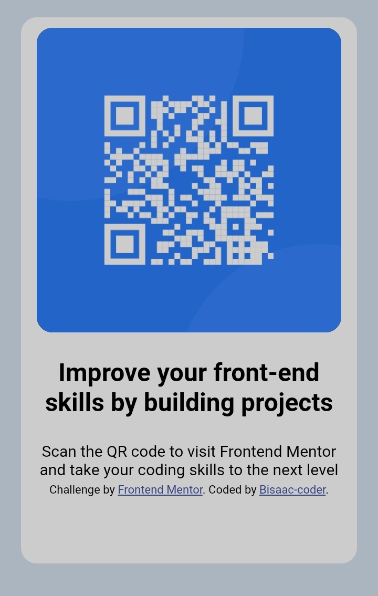

# Frontend Mentor - QR code component solution

This is a solution to the [QR code component challenge on Frontend Mentor](https://www.frontendmentor.io/challenges/qr-code-component-iux_sIO_H). Frontend Mentor challenges help you improve your coding skills by building realistic projects. 

## Table of contents

- [Overview](#overview)
  - [Screenshot](#screenshot)
  - [Links](#links)
- [My process](#my-process)
  - [Built with](#built-with)
  - [What I learned](#what-i-learned)
  - [Continued development](#continued-development)
  - [Useful resources](#useful-resources)
  - [AI Collaboration](#ai-collaboration)
- [Author](#author)
- [Acknowledgments](#acknowledgments)


## Overview
This is a qr code challenge by 
frontend mentor which was completed 
by Bisaac-coder.

### Screenshot



### Links

- Solution URL: [GitHub Repo](https://github.com/Bisaac-coder/Qr-code-component)
- Live Site URL: [Bisaac-coder live site](https://bisaac-coder.github.io/Qr-code-component/)

## My process

I started with adding the qr code 
by extracting it from the images
 folder into the main folder.I then
proceeded by sectioning the elements
in a <div>,which helped in aligning 
contents .And finally concluded with
the inline css styling.

### Built with

- Semantic HTML5 markup
- internal css ( <style> )


### What I learned

I learned how to adjust contents of the 
page,using items like justify-item,
text-align and also about a font new to me 
the"outfit" font.
The inline css was what made me more focused,
although i had some typing error i was still
able to debug and filter them out.


```html

<!DOCTYPE html>
<html lang="en">
<head>
  <meta charset="UTF-8">
  <meta name="viewport" content="width=device-width, initial-scale=1.0"> 

  <link rel="icon" type="image/png" sizes="32x32" href="./images/favicon-32x32.png">
  
  <title>Frontend Mentor | QR code component</title>

  

</head>
<body>
  <div class="div">

    <h1>Improve your front-end skills by building projects</h1>

    <p>  Scan the QR code to visit Frontend Mentor and take your coding skills to the next level</p>
  
  <footer class="attribution">
    Challenge by <a href="https://www.frontendmentor.io?ref=challenge">Frontend Mentor</a>. 
    Coded by <a href="https://www.frontendmentor.io/profile/Bisaac-coder">Bisaac-coder</a>.
  </footer>
  </div>
</body>
</html>
```

```css

  body{
    background-color:#D6E2F0;
  }
  *{
    margin:0; padding:0;
  }
    .attribution { font-size: 0.6875rem; text-align: center; }
    .attribution a { color: hsl(228, 45%, 44%); }
 
  .div{padding:10px;margin:20px auto;
    background-color:#ffffff;
    width:300px; height:500px;
    justify-items:center;
    border-radius:15px;
  }
  h1{margin:10px auto;
    font-size:24px;
    font-family:"outfit";
    font-weight:700;
    text-align:center;
    padding:10px;
  }
  p{font-size:15px; 
    font-weight:400;
    font-family:"outfit";padding:4px; 
    text-align:center;
  }
  .img{ background-color:black;
    margin-left:5px ; padding:0;
    text-align:center; border-radius:15px;
 }
  
```

### Continued development

For now i would continue to develop
in my html and css aspect to get mor experience
as a newbie.


### Useful resources

-(https://www.youtube.com) - This helped me for understanding the basics of html and css through webglowacademy,Dave gray's and kelvin powell html and css basics .
 I really liked this pattern and will use it going forward.

### AI Collaboration

-Tools i used ?
I used claude.

-How did i use them ?
I used claude for debugging and brainstorming 
solutions.

- What worked well?
the debugging and brainstorming solutions
- What didn't?
nothing

## Author
- Frontend Mentor - [Bisaac-coder](https://www.frontendmentor.io/profile/Bisaac-coder)


## Acknowledgments
Dave Gray /kelvin powell - your youtube tutorials really helped a lot
